# Solvedoku

- [Solvedoku](#solvedoku)
  - [What is Solvedoku](#what-is-solvedoku)
  - [Features](#features)
  - [Screenshots and Usage Examples](#screenshot-and-usage-examples)
    - [Toolbar](#toolbar)  
    - [Classic Sudoku](#classic-sudoku)
    - [Jigsaw Sudoku](#jigsaw-sudoku)
  - [Used resources](#resources)
    -[Solver source](#solver-source)
    -[Used icons](#used-icons)

## What is Solvedoku

'Solvedoku' is a multilingual (hungarian, english) sudoku solver software made for my grandfather's birthday. Earlier I developed it without MVVM pattern, but I wanted to
make it MVVM as I got more knowledge about this topic.

## Features

With this software you can solve:
- **Classic sudokus:** 4x4, 6x6, 9x9 table sizes, you can apply SudokuX rule for all of them.
- **Puzzle sudokus:** 9x9 table size

**Switch languages on the fly! (Currently english or hungarian).**
You can save and load Sudokus with their own current states in the software.
Get only one, or all solutions for a Sudoku table is also possible.
**The software is multithreaded, so for example if it is solving a classic table, you can still switch to the Jigsaw tab and work there!**

I tried to make the graphical interface as transparent as possible so that even less experienced users can enjoy this software.

## Screenshots and Usage Examples

### Toolbar

At the start of the program, this picture welcomes us:

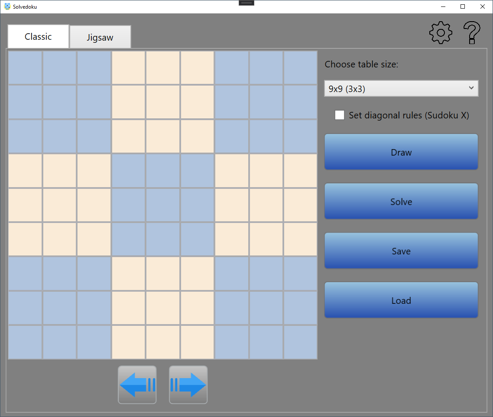

The gear icon shows the options window, which is very simple at the moment. Here you can change the software language.

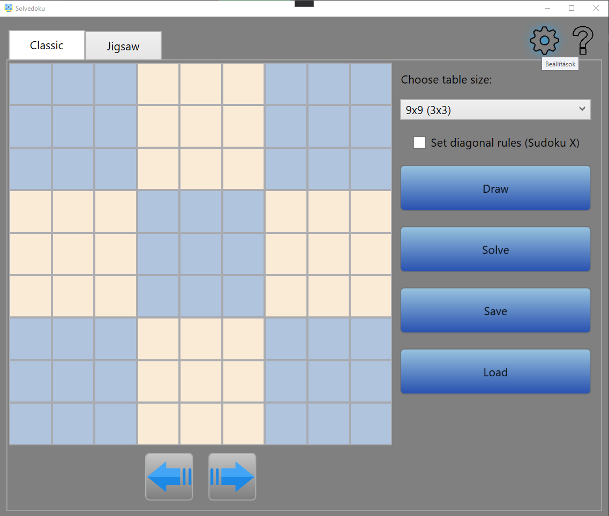

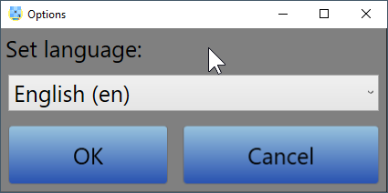

The question mark icon shows the about box, which contains my name, the version, and a small description about this software.

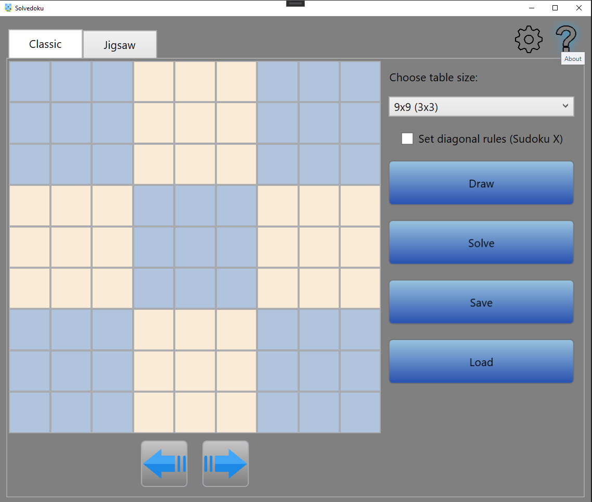

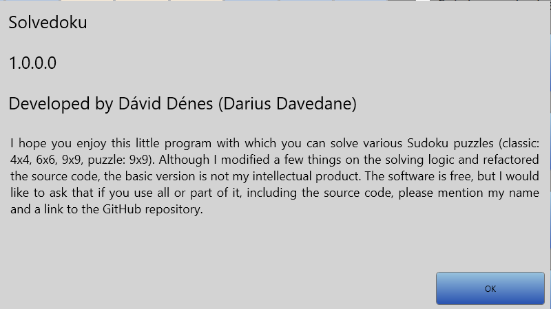

### Classic Sudoku

Let's stay on the Classic tab page:

At the top of the page you can choose between table sizes. There are 9x9 (3x3), 6x6 (3x2), 4x4(2x2) possibilities.
Under the size selection box you can enable diagonal rules, which will be also represented by the GUI:

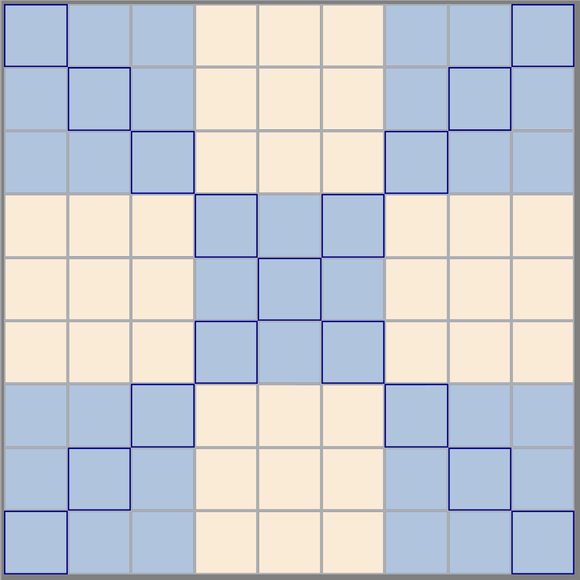

Now lets see the buttons.

-**Draw:** You can draw a new table with this button, according to the chosen table size at the above. 
If there are already any numbers in the table, you will be asked if you are sure to draw a new one.

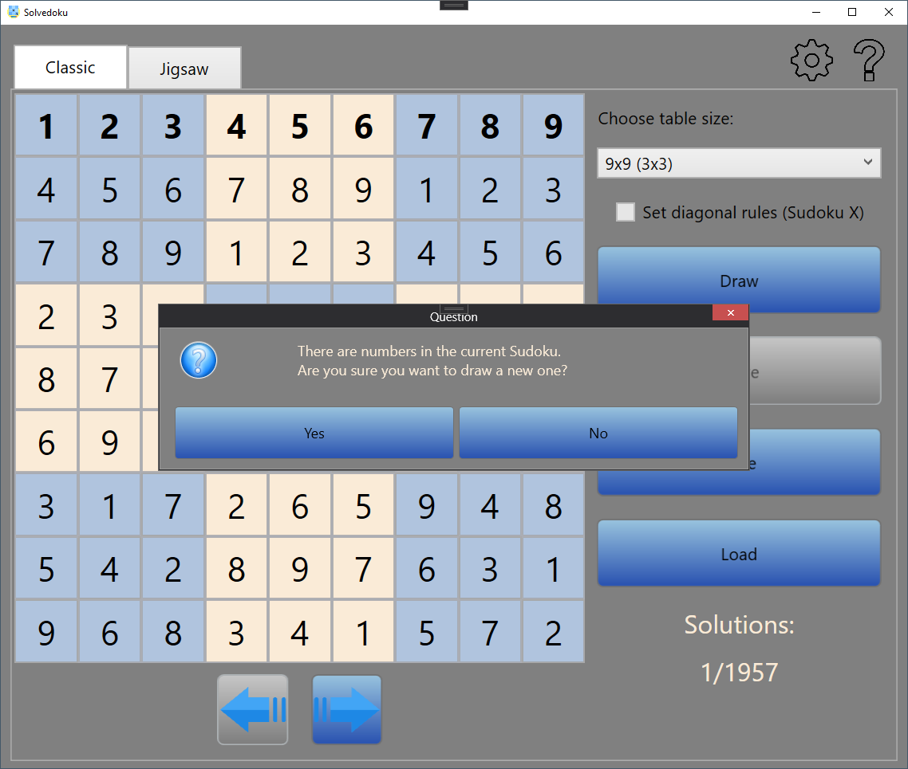

-**Solve:** You can solve the current table **what is visible** on the screen.
It is important, because you can do that for example if you have an already solved table with more solutions, you can switch to the sixth one with the arrows below the table and clear some numbers from it, then you can solve this new table with the software. Before the solving process here you can choose if you would like to get only one possible solution or all of the solutions for the table. If there where predefined numbers in the table they will be appeared in bold style after the solving process.

**Important: If there are too many solutions the process will be running only for a while, depending on you computer's resources it will run out of memory.** The button is disabled if there aren't any empty cells in the table.

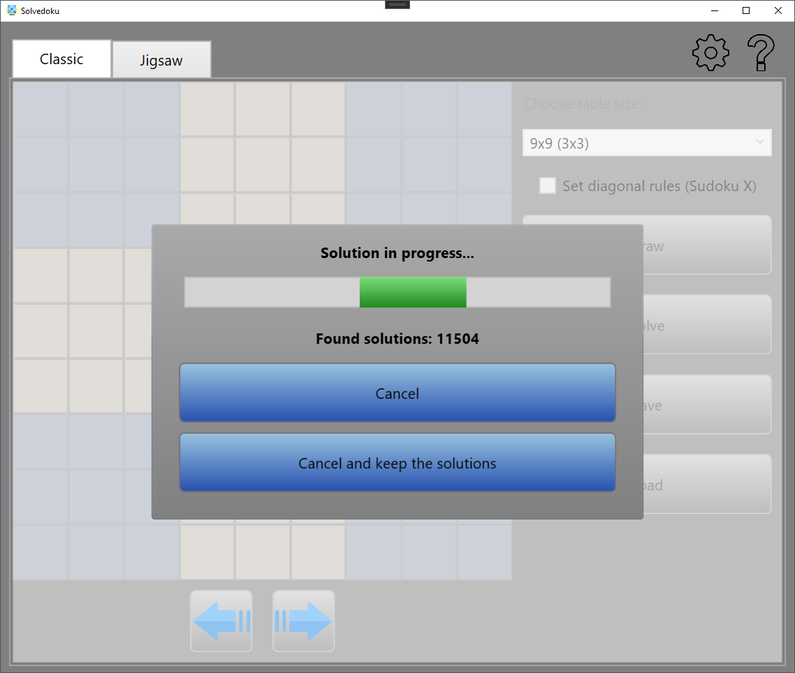

You can interrupt the solving process any tyme with two ways: simply cancel the solution, or you can cancel the process but keep the already found solutions.

Solved table with predefined numbers:

-**Save:** With this button you can save the current state of the table and its solutions (if there are any) **into a CSU file**. I also saves the solution counter position, it is useful if there are a lot of and you only checked half of them, but you would like to continue at a later time. If you save a table with a ton of solutions you cancel the process easily.

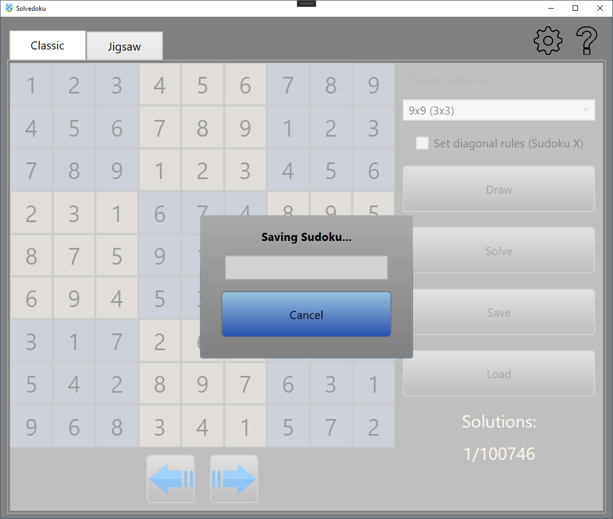

-**Load:** You can load previously saved CSU files. If you load a huge one you cancel the process easily.

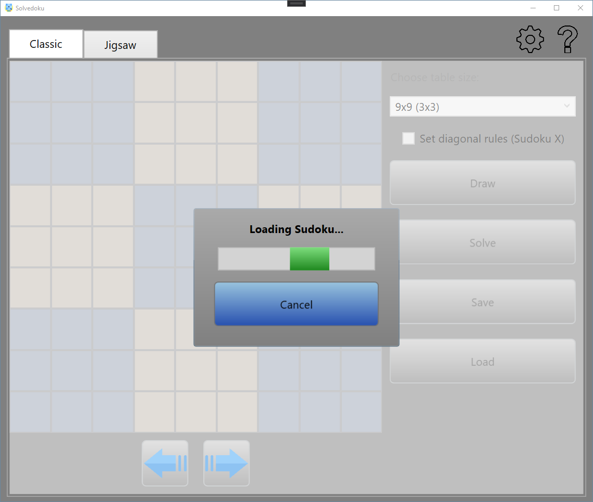

-**Arrow buttons** Use these to switch between solutions.

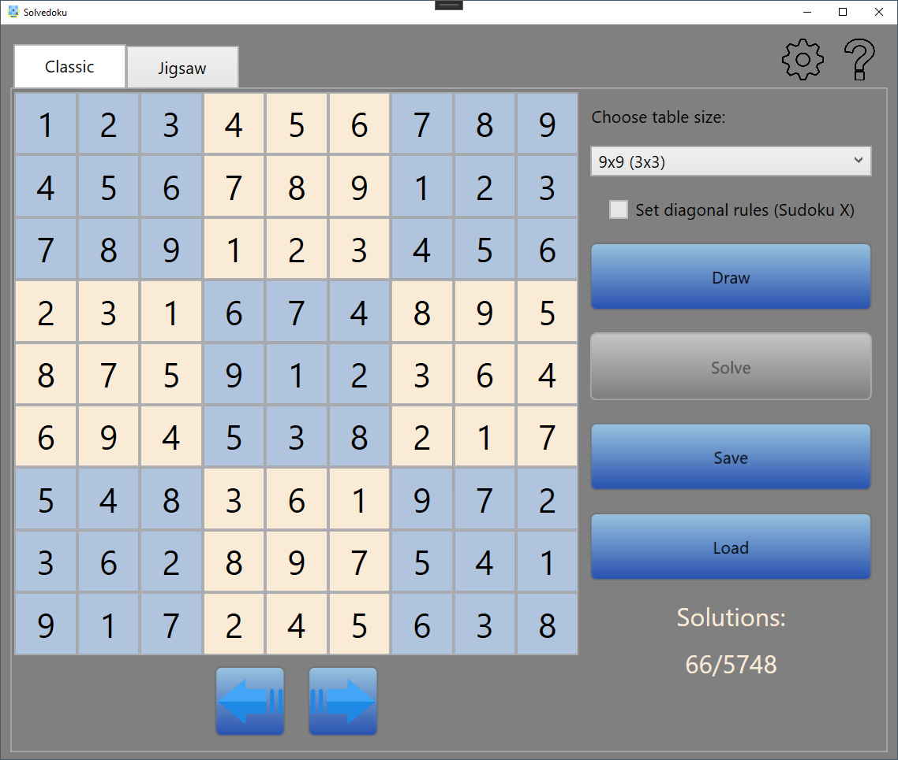

### Jigsaw Sudoku

The most of the functionalities are the same here as at the classic sudoku. I would like to show you just the differences.

We are on the Jigsaw tab page:

As you can see here we can solve only 9x9 tables (currently). At the right top we can find the colorpicker where we can choose from ten different colors:

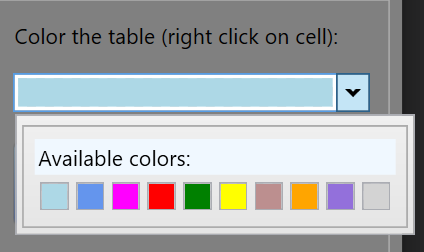

As the text says you can paint any cell by clicking on them with the right mouse button. **Dragging the mouse while the button is pressed is possible, so you don't have to click 81 times in a table ;).**

Another thing what I have to mention is that the "Draw" button also clears the colors of the cells and not only the numbers.

The saving and loading logic uses JSU files here.

Jigsaw sudoku made to be classic (just for fun) and solved:

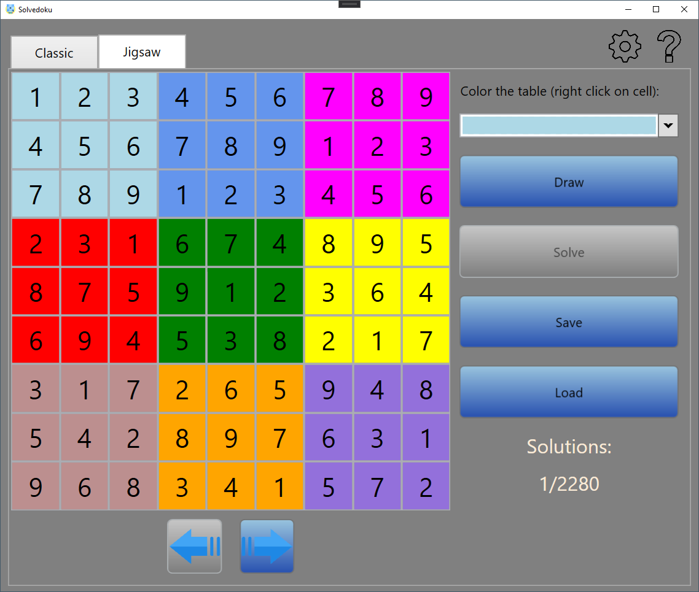

## Used Resources

### Solver source:
**_The solver mechanism is not my intellectual product_, I fixed some bugs in it and implemented the 6x6 solving function in the past!**  
I found it on a forum a long time ago, so I wanted to put here the author but nowadays the source disappeared from the internet.  
**_So, if you are the one, please contact me!_**  

### Used icons:

The gear and the help icon is made by me with Inkscape.

**Main icon**

Icons made by <a href="https://www.freepik.com" title="Freepik">Freepik</a> from <a href="https://www.flaticon.com/" title="Flaticon">www.flaticon.com</a>

**Left and right arrow icons**

Icons made by <a href="" title="Pixelmeetup">Pixelmeetup</a> from <a href="https://www.flaticon.com/" title="Flaticon">www.flaticon.com</a>

